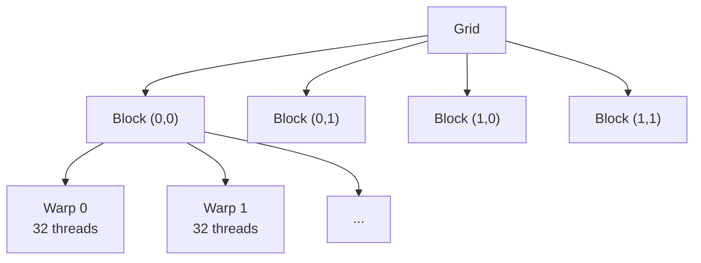

# CUDA 编程基础

::: tip 待完善
本页为骨架，后续补充详细内容。
:::

## 线程层次

## 内存层次

| 内存类型 | 作用域 | 大小 | 延迟 |
|---------|-------|------|------|
| Register | Thread | ~256KB/SM | 1 cycle |
| Shared Memory | Block | 48-228KB/SM | ~20 cycles |
| L1 Cache | SM | 共享 SMEM | ~20 cycles |
| L2 Cache | Device | 数 MB | ~200 cycles |
| Global Memory (HBM) | Device | 数十 GB | ~400 cycles |

## 面试要点

- threadIdx / blockIdx / blockDim 的计算
- Bank conflict 是什么？如何避免？
- Coalesced memory access
- Occupancy 与性能的关系
- Warp divergence 的影响
