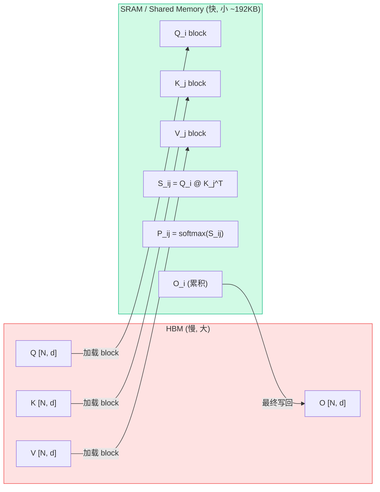
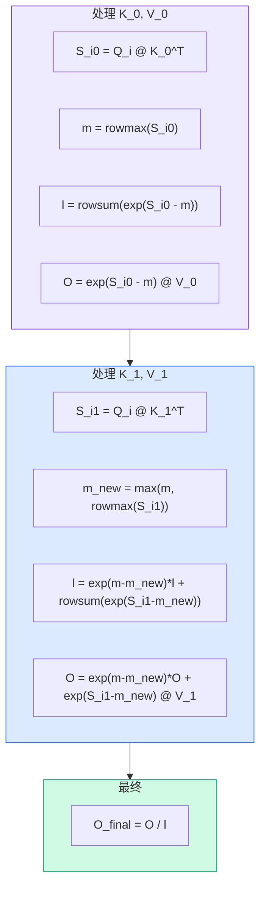

# FlashAttention

## 核心问题：标准 Attention 为什么慢？

标准 Attention 的瓶颈**不是计算，而是显存访问 (memory-bound)**。

$$\text{Attn}(Q,K,V) = \text{softmax}\left(\frac{QK^T}{\sqrt{d}}\right) V$$

标准实现需要把 $N \times N$ 的 attention 矩阵 $S = QK^T$ **写回 HBM**，再读出来做 softmax，再写回，再读出来乘 V：

```
标准 Attention (N=seq_len, d=head_dim):

Step 1: S = Q @ K^T        → 写 S [N, N] 到 HBM      ← 巨大！
Step 2: P = softmax(S)     → 读 S, 写 P [N, N] 到 HBM
Step 3: O = P @ V          → 读 P, 写 O [N, d] 到 HBM

HBM 读写量: O(N² + N²) = O(N²)
显存占用:   O(N²)  ← seq_len=4096 时，4096²×2bytes = 32MB/head/layer
```

**问题**：HBM 带宽有限（A100: ~2TB/s），N² 的读写量成为瓶颈。

## FlashAttention 的两个核心思想

### 思想一：Tiling（分块计算）

**不在 HBM 中存 N×N 矩阵，而是分块在 SRAM (Shared Memory) 中计算。**



将 Q 分成 $T_r = \lceil N/B_r \rceil$ 块，K/V 分成 $T_c = \lceil N/B_c \rceil$ 块：

```
Q = [Q_1, Q_2, ..., Q_Tr]    每块 [Br, d]
K = [K_1, K_2, ..., K_Tc]    每块 [Bc, d]
V = [V_1, V_2, ..., V_Tc]    每块 [Bc, d]
```

**外层循环遍历 K/V 的块，内层循环遍历 Q 的块**：

```python
for j in range(T_c):           # 遍历 K, V 的每个 block
    load K_j, V_j to SRAM
    for i in range(T_r):       # 遍历 Q 的每个 block
        load Q_i to SRAM
        S_ij = Q_i @ K_j^T     # [Br, Bc] — 在 SRAM 中计算，不写回 HBM！
        P_ij = softmax(S_ij)   # 在 SRAM 中
        O_i += P_ij @ V_j      # 累积结果
    end
end
write O back to HBM             # 只写最终结果
```

**关键**：$S_{ij}$ 的大小是 $B_r \times B_c$（如 128×128），远小于 $N \times N$，完全放得进 SRAM。

### 思想二：Online Softmax（在线 softmax）

分块计算有个问题：**softmax 需要看到一整行的数据才能算**。

$$\text{softmax}(x_i) = \frac{e^{x_i}}{\sum_j e^{x_j}}$$

分母 $\sum_j e^{x_j}$ 需要遍历整行，但分块时我们一次只看到一部分。

**解决方案：Online Softmax** — 通过维护 **running max** 和 **running sum** 增量更新。

#### 两遍 → 一遍 的演进

**标准 softmax (两遍)**：
```
Pass 1: m = max(x_1, x_2, ..., x_N)          # 找最大值
Pass 2: softmax(x_i) = e^(x_i - m) / Σ e^(x_j - m)  # 计算
```

**Online softmax (一遍，Milakov & Gimelshein 2018)**：

逐步处理新元素，增量更新 max 和 sum：

```python
m_0 = -inf      # running max
l_0 = 0         # running sum of exp

for j in range(N):
    m_new = max(m_old, x_j)                    # 更新 max
    l_new = l_old * exp(m_old - m_new) + exp(x_j - m_new)  # 修正旧 sum + 加入新项
    m_old = m_new
    l_old = l_new

softmax(x_i) = exp(x_i - m_final) / l_final
```

**核心公式**：当 max 从 $m^{(old)}$ 更新到 $m^{(new)}$ 时，旧的 sum 需要乘以修正因子 $e^{m^{(old)} - m^{(new)}}$

#### FlashAttention 中的 Online Softmax（块级别）

FlashAttention 将 online softmax 扩展到**按块更新**：

每个 Q block $Q_i$ 对应的输出 $O_i$，在遍历 K/V block 时逐步累积：

```python
# 初始化
m_i = [-inf] * Br        # 每行的 running max, shape [Br]
l_i = [0] * Br           # 每行的 running sum, shape [Br]  
O_i = zeros(Br, d)       # 累积输出

for j in range(T_c):     # 遍历每个 K_j, V_j block
    # 1. 计算当前块的 attention score
    S_ij = Q_i @ K_j^T / sqrt(d)         # [Br, Bc]
    
    # 2. 当前块的行最大值
    m_ij = rowmax(S_ij)                   # [Br]
    
    # 3. 更新 running max
    m_new = max(m_i, m_ij)               # [Br]
    
    # 4. 修正因子
    alpha = exp(m_i - m_new)             # 旧 max 到新 max 的修正
    beta  = exp(m_ij - m_new)            # 当前块到新 max 的修正
    
    # 5. 更新 running sum
    l_new = alpha * l_i + beta * rowsum(exp(S_ij - m_ij))
    
    # 6. ★ 关键：修正旧的 O_i，加上新块的贡献
    P_ij = beta * exp(S_ij - m_ij)       # 当前块的 attention weights
    O_i = alpha * O_i + P_ij @ V_j       # 修正旧结果 + 新贡献 (diag(alpha) 实际上)
    
    # 7. 更新状态
    m_i = m_new
    l_i = l_new

# 最终归一化
O_i = O_i / l_i    # diag(l_i)^{-1} @ O_i
```



## IO 复杂度分析

| | HBM 读写量 | 显存占用 |
|---|---|---|
| 标准 Attention | $O(N^2 d + N^2)$ | $O(N^2)$ |
| FlashAttention | $O(N^2 d^2 / M)$ | $O(N)$ |

其中 $M$ 是 SRAM 大小。因为 $d \ll M$（$d$=128, $M$=192KB），所以 $d^2/M \ll 1$，**HBM 读写量大幅减少**。

直觉理解：
- 标准方法：N×N 矩阵要完整写入/读出 HBM **2-3 次**
- FlashAttention：每个 block 只从 HBM 读一次 Q/K/V，在 SRAM 中算完直接累积，**从不把 N×N 矩阵写回 HBM**

## FlashAttention-2 的改进

FlashAttention-2 在 FA1 基础上优化了 **GPU 并行度**：

| | FlashAttention-1 | FlashAttention-2 |
|---|---|---|
| 外层循环 | K/V blocks | **Q blocks** |
| 内层循环 | Q blocks | **K/V blocks** |
| 并行维度 | batch × head | batch × head × **T_r** |
| 线程块分工 | 一个 block 算一个 (i,j) | 一个 block 负责一整行 Q_i |

**为什么交换循环顺序更好**：
- FA1：每个 thread block 算一个 $(Q_i, K_j)$ 对，不同 thread block 需要对同一个 $O_i$ 做 reduce → 需要同步
- FA2：每个 thread block 负责一个 $Q_i$ 的**完整输出**，遍历所有 K/V block → **无需跨 block 同步**，减少 shared memory 读写

其他优化：
- 减少非矩阵乘 (non-matmul) FLOPs：把 rescaling 推迟到最后
- 更好的 warp 分工：4 个 warp 并行算不同的 K/V block，而不是拆分 Q

## FlashAttention-3 (Hopper GPU)

针对 H100 (Hopper) 架构的优化：

- **WGMMA 指令**：利用 Tensor Core 的异步矩阵乘
- **Ping-pong scheduling**：两个 warp group 交替执行 GEMM 和 softmax，实现 overlap
- **FP8 支持**：结合 block quantization 的低精度计算

## 面试高频问答

::: details Q: FlashAttention 为什么快？是算法优化还是硬件优化？
**IO 优化 (memory-bound optimization)**，不是减少 FLOPs。

FlashAttention 的 FLOPs 和标准 Attention **完全相同**（甚至略多，因为 rescaling）。它快是因为：
1. 分块 (tiling) 让计算在 SRAM 中完成，**减少了 HBM 读写量**
2. 标准实现是 memory-bound（被带宽限制），FlashAttention 把它变得更接近 compute-bound

类比：矩阵乘法的分块优化——FLOPs 不变，但 cache 命中率大幅提高。
:::

::: details Q: Online softmax 是怎么做到一遍计算的？
维护两个 running 状态：**running max** $m$ 和 **running sum** $l$。

每看到新的一组值时：
1. 更新 max：$m_{new} = \max(m_{old}, m_{current})$
2. 修正旧 sum：$l_{old} \times e^{m_{old} - m_{new}}$（因为 max 变了，之前的 exp 需要修正）
3. 加入新项：$+ \sum e^{x_{new} - m_{new}}$
4. 对输出 O 也做同样的修正：$O = e^{m_{old} - m_{new}} \times O_{old} + P_{new} \times V_{new}$

核心公式就一个修正因子 $e^{m_{old} - m_{new}}$。
:::

::: details Q: FlashAttention 的显存从 O(N²) 降到了什么？
**O(N)**。

不需要存 $N \times N$ 的 attention 矩阵 $S$ 和 $P$。只需要存：
- Q, K, V, O：各 $[N, d]$，共 $O(Nd)$
- 中间状态 m, l：各 $[N]$，共 $O(N)$
- SRAM 中的 block：$O(B_r \times B_c)$，不占 HBM

总计 $O(Nd) = O(N)$（$d$ 是常数）。
:::

::: details Q: 分块大小 $B_r, B_c$ 怎么选？
受 SRAM 大小 $M$ 约束：

$$B_r \times d + B_c \times d + B_r \times B_c \leq M$$

即：$Q_i$ 块 + $K_j/V_j$ 块 + $S_{ij}$ 块 要能放进 SRAM。

实践中 A100 (192KB SRAM, d=128)：$B_r = B_c = 128$ 是常见选择。
:::

::: details Q: FlashAttention 不能做的事？
1. **不能返回 attention weights**：$P = \text{softmax}(S)$ 矩阵从不完整存在，无法做 attention visualization
2. **Causal mask 的处理**：需要在分块时跳过不需要的块，FA2 对此有优化
3. **自定义 attention pattern**：稀疏 attention 等需要特殊适配
:::

::: details Q: FA1 和 FA2 的主要区别？
1. **循环顺序反转**：FA2 外层循环 Q，内层循环 K/V → 每个 thread block 算一个 Q block 的完整输出，**无需跨 block 同步**
2. **并行度提升**：FA2 在 seq_len 维度额外并行（batch × head × T_r）
3. **减少非 matmul 计算**：rescaling 推迟，减少 SRAM 读写
4. 结果：FA2 在 A100 上达到理论 FLOPs 的 **~73%**，FA1 只有 ~35%
:::
