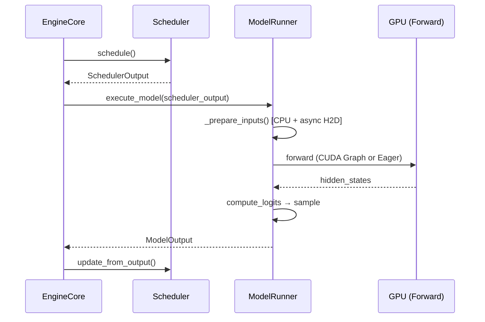
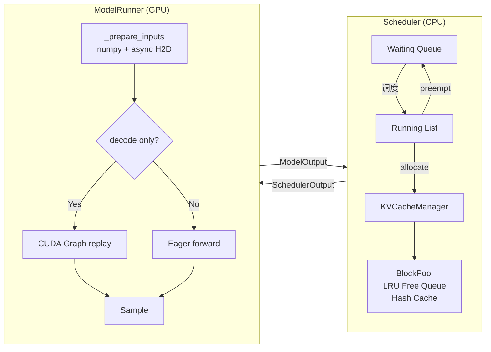

# vLLM 推理引擎框架

从全局到局部理解 vLLM（v1 架构）如何生成一个 token。

> 代码引用基于 [vLLM v0.8.x](https://github.com/vllm-project/vllm) 开源版本，文件路径均为 `vllm/v1/` 下。

---

## 1. 全局循环：一个 Token 的生命周期



核心主循环只有 3 行（`vllm/v1/engine/core.py`）：

```python
def step(self) -> EngineCoreOutputs:
    scheduler_output = self.scheduler.schedule()
    output = self.model_executor.execute_model(scheduler_output)
    engine_core_outputs = self.scheduler.update_from_output(scheduler_output, output)
    return engine_core_outputs
```

每次 `step()` = **调度 → 执行 → 更新**，循环驱动所有 request 的 token 生成。

---

## 2. 设计问题与解法总览

| 问题 | 解法 | 核心文件 |
|------|------|----------|
| GPU 利用率低（逐请求处理） | Continuous Batching | `core/sched/scheduler.py` |
| KV Cache 显存碎片 | PagedAttention + Block Pool | `core/kv_cache_manager.py`, `core/block_pool.py` |
| Decode 阶段 kernel launch 开销大 | CUDA Graph | `worker/gpu_model_runner.py` |
| Prefill/Decode 互相阻塞 | Chunked Prefill | Scheduler token budget 控制 |
| 长文本 prompt prefix 重复计算 | Prefix Caching | BlockPool hash 机制 |
| H2D 传输阻塞 GPU 计算 | Async Prepare Inputs | `_prepare_inputs()` overlap |
| Decode 太慢（自回归逐 token） | Speculative Decoding | Draft model + verify |

---

## 3. 深入：Scheduler

**文件**: `vllm/v1/core/sched/scheduler.py`

### 3.1 设计思想

vLLM v1 **没有独立的 prefill/decode 阶段**。每个 request 跟踪 `num_computed_tokens`，scheduler 统一按 token budget 调度：

- Running request：`num_new_tokens = num_tokens - num_computed_tokens`（未计算完的 = 还在 prefill）
- Decode request：`num_new_tokens = 1`（已完成 prefill）

这就是 **Continuous Batching** 的实现——prefill 和 decode 请求混在同一个 batch 里。

### 3.2 调度流程

```python
def schedule(self) -> SchedulerOutput:
    token_budget = self.max_num_scheduled_tokens

    # Phase 1: 调度已在运行的请求
    for request in self.running:
        num_new_tokens = min(
            request.num_tokens - request.num_computed_tokens,
            token_budget)
        new_blocks = self.kv_cache_manager.allocate_slots(request, num_new_tokens)
        if new_blocks is None:
            # OOM → Preempt：驱逐优先级最低的请求
            victim = self.running.pop()  # 末尾 = 最低优先级
            self.kv_cache_manager.free(victim)
            victim.status = PREEMPTED
        else:
            token_budget -= num_new_tokens

    # Phase 2: 调度等待队列中的新请求（仅在没有 preemption 时）
    while self.waiting and token_budget > 0:
        request = self.waiting[0]
        # Prefix Cache 查找：已有哪些 block 可复用
        computed_blocks, num_computed_tokens = \
            self.kv_cache_manager.get_computed_blocks(request)
        num_new_tokens = min(request.num_tokens - num_computed_tokens, token_budget)
        new_blocks = self.kv_cache_manager.allocate_slots(
            request, num_new_tokens, computed_blocks)
        if new_blocks is None:
            break  # 容量不够，停止调度新请求
        self.waiting.popleft()
        self.running.append(request)
        token_budget -= num_new_tokens
```

### 3.3 关键设计点

- **Token Budget** (`max_num_scheduled_tokens`)：限制每步最大 token 数，实现 Chunked Prefill
- **Preemption**：显存不够时驱逐优先级最低的请求，释放 KV cache block，可 swap 到 CPU
- **Prefix Cache**：调度新请求前先查 BlockPool 有没有现成的 prefix block 可复用

---

## 4. 深入：KV Cache 管理

### 4.1 核心抽象

```
┌─────────────────────────────────────────────┐
│               KVCacheManager                │
│  req_to_blocks: {req_id → [Block, ...]}     │
│  ├─ allocate_slots(req, num_tokens)         │
│  ├─ free(req)                               │
│  └─ get_computed_blocks(req)  [prefix cache]│
├─────────────────────────────────────────────┤
│                 BlockPool                    │
│  blocks: [KVCacheBlock × num_gpu_blocks]    │
│  free_block_queue: DoublyLinkedList (LRU)   │
│  cached_block_hash_to_block: {hash → block} │
│  ├─ get_new_blocks(n)                       │
│  ├─ free_blocks(blocks)                     │
│  └─ touch(blocks) [promote, prevent evict]  │
└─────────────────────────────────────────────┘
```

**文件**: `vllm/v1/core/kv_cache_manager.py`, `vllm/v1/core/block_pool.py`

### 4.2 allocate_slots：分配 KV Cache

```python
def allocate_slots(self, request, num_tokens, new_computed_blocks=None):
    req_blocks = self.req_to_blocks[request.request_id]

    # 计算需要多少 block
    num_computed_tokens = request.num_computed_tokens + len(new_computed_blocks) * block_size
    num_required_blocks = cdiv(num_computed_tokens + num_tokens, self.block_size)
    num_new_blocks = num_required_blocks - len(req_blocks) - len(new_computed_blocks)

    # 检查是否有足够的空闲 block
    if num_new_blocks > self.block_pool.get_num_free_blocks():
        return None  # 触发 preemption

    # Touch prefix cache blocks（提升 LRU 优先级，防止被驱逐）
    self.block_pool.touch(new_computed_blocks)
    req_blocks.extend(new_computed_blocks)

    # 从 free pool 分配新 block
    new_blocks = self.block_pool.get_new_blocks(num_new_blocks)
    req_blocks.extend(new_blocks)

    # 为满的 block 注册 hash（供后续 prefix cache 查找）
    self.block_pool.cache_full_blocks(request, req_blocks)
    return new_blocks
```

### 4.3 BlockPool：LRU 驱逐 + Prefix Cache

```python
class BlockPool:
    def __init__(self, num_gpu_blocks, enable_caching):
        self.blocks = [KVCacheBlock(idx) for idx in range(num_gpu_blocks)]
        self.free_block_queue = FreeKVCacheBlockQueue(self.blocks)  # 双向链表，LRU 顺序
        self.cached_block_hash_to_block = defaultdict(dict)         # hash → block

    def get_new_blocks(self, num_blocks):
        ret = []
        for _ in range(num_blocks):
            block = self.free_block_queue.popleft()       # 取最久未用的
            self._maybe_evict_cached_block(block)         # 清除旧 hash 元数据
            block.incr_ref()
            ret.append(block)
        return ret

    def free_blocks(self, ordered_blocks):
        for block in ordered_blocks:
            block.decr_ref()
            if block.ref_cnt == 0:
                self.free_block_queue.append(block)       # 放回队尾（最近使用）

    def touch(self, blocks):
        for block in blocks:
            if block.ref_cnt == 0:
                self.free_block_queue.remove(block)       # 从 free 队列移除
            block.incr_ref()                              # 引用计数 +1，防止驱逐
```

### 4.4 Prefix Cache 工作原理

1. 当一个 block 被填满时，根据其 token 内容计算 hash，注册到 `cached_block_hash_to_block`
2. 新请求到来时，`get_computed_blocks()` 用 prompt token 计算 hash，查表找到已有 block
3. 找到的 block 通过 `touch()` 提升优先级，直接复用（不用重算 KV）
4. 未命中的 block 才需要走 prefill 计算

---

## 5. 深入：GPU Model Runner

**文件**: `vllm/v1/worker/gpu_model_runner.py`

### 5.1 execute_model：调度执行

```python
@torch.inference_mode()
def execute_model(self, scheduler_output):
    self._update_states(scheduler_output)

    # 准备输入（CPU numpy + async H2D）
    attn_metadata, logits_indices = self._prepare_inputs(scheduler_output)

    # 选择执行路径
    if decode_only:
        executor = self.graph_runners[batch_size]   # CUDA Graph
    else:
        executor = self.model                        # Eager

    # Forward
    hidden_states = executor(input_ids, positions, ...)

    # Sample
    logits = self.model.compute_logits(hidden_states[logits_indices])
    return self.sampler(logits, sampling_metadata)
```

### 5.2 _prepare_inputs：CPU/GPU Overlap

这是 vLLM v1 的关键性能优化——利用 async H2D 把 CPU 准备和 GPU 传输重叠：

```python
def _prepare_inputs(self, scheduler_output):
    # Step 1: 先启动 block_table 的 H2D 传输（后台 DMA）
    self.input_batch.block_table.commit(num_reqs)

    # Step 2: CPU 侧用 numpy 准备数据（与 Step 1 的传输并行）
    num_scheduled_tokens = np.array([...])

    # 构建 req_indices: [2,5,3] → [0,0,1,1,1,1,1,2,2,2]
    req_indices = np.repeat(arange[:num_reqs], num_scheduled_tokens)

    # 构建 positions = num_computed_tokens + local_offset
    positions_np = num_computed_tokens[req_indices] + arange_offsets

    # 收集 token_ids（index_select 比 np.take 快）
    token_indices = positions_np + req_indices * max_seq_len
    torch.index_select(token_ids_flat, 0, torch.from_numpy(token_indices),
                       out=self.input_ids_cpu[:total])

    # Step 3: Async H2D（non_blocking=True）
    self.input_ids[:total].copy_(self.input_ids_cpu[:total], non_blocking=True)
    self.positions[:total].copy_(self.positions_cpu[:total], non_blocking=True)

    # Step 4: 构建 FlashAttention metadata
    attn_metadata = self.attn_metadata_builder.build(...)
    return attn_metadata, logits_indices
```

时间线：
```
CPU: ████ numpy 计算 ████████████████
GPU:      ████ block_table DMA ████ input_ids DMA ████ forward...
                  ↑ overlap ↑
```

### 5.3 CUDA Graph：消除 Decode Launch 开销

Decode 阶段每个 request 只生成 1 token，计算量极小但 kernel launch 次数和 prefill 一样多。CUDA Graph 把整个 forward pass 录制下来，replay 时一次 launch 所有 kernel。

```python
def capture_model(self):
    """启动时录制各 batch_size 的 CUDA Graph"""
    for batch_size in cudagraph_capture_sizes:  # [1, 2, 4, 8, ..., 192]
        # 用虚拟输入录制
        graph_runner = CUDAGraphRunner(self.model)
        graph_runner.capture(
            input_ids=dummy_ids[:batch_size],
            positions=dummy_pos[:batch_size],
            attn_metadata=attn_metadata,
            memory_pool=self.graph_memory_pool,
        )
        self.graph_runners[batch_size] = graph_runner
```

运行时根据实际 batch size 选最近的 graph：
- batch=5 → pad 到 8，用 `graph_runners[8].replay()`
- 只对 decode-only batch 使用（prefill 变长，无法固定 shape）

---

## 6. 核心数据流总结



---

## 7. 与面试的关联

::: details 常见面试问题

**Q: vLLM 的 Continuous Batching 是怎么实现的？**

不区分 prefill/decode 阶段。每个请求追踪 `num_computed_tokens`，scheduler 每步用 token budget 统一调度。新请求进来和正在 decode 的请求在同一 batch 里，某个请求生成完毕直接移除，新请求立即填入。

**Q: PagedAttention 解决什么问题？**

传统方式按 max_seq_len 预分配连续显存 → 巨大浪费。PagedAttention 将 KV Cache 切成固定大小的 block（如 16 tokens/block），按需分配，类似 OS 虚拟内存分页。Block 可以不连续存放，通过 block_table 映射。

**Q: CUDA Graph 为什么只能用在 decode？**

CUDA Graph 要求 tensor shape 固定。Decode 时每个 request 只有 1 个新 token，batch 内 shape 可预知。Prefill 时 prompt 长度各异，无法固定。

**Q: 显存不够时怎么办？**

Scheduler 的 preemption 机制：`allocate_slots` 返回 None → 驱逐优先级最低的 running request，释放其 KV block。被驱逐的请求可 swap 到 CPU 内存，后续恢复时 swap in 而非重算。

**Q: Prefix Cache 是怎么工作的？**

当 block 满时按 token 内容计算 hash，存入 `cached_block_hash_to_block`。新请求用相同 prompt 前缀时，scheduler 查表命中已有 block，直接复用 KV 值（touch 防止驱逐），跳过 prefill 计算。

**Q: vLLM 如何做 CPU/GPU overlap？**

`_prepare_inputs` 先启动 block_table 的 async H2D 传输，然后在 CPU 上用 numpy 准备 input_ids、positions 等（与传输并行），最后 `non_blocking=True` 拷贝到 GPU。CPU 和 GPU 工作时间线重叠。

:::
