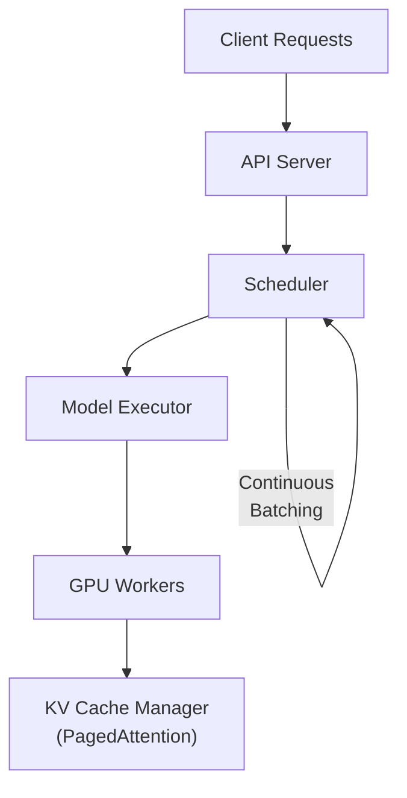

# vLLM 推理引擎

::: tip 待完善
本页为骨架，后续补充详细内容。
:::

## 架构总览

## 核心组件

- **Scheduler**: Continuous Batching，动态组 batch
- **PagedAttention**: KV Cache 分页管理，消除碎片
- **Block Manager**: 物理/逻辑 block 映射
- **Model Executor**: TP/PP 分布式执行

## 面试要点

- Prefill vs Decode 阶段的区别
- Continuous Batching 如何提高吞吐
- PagedAttention 为什么比连续分配更高效
- Scheduler 的调度策略 (FCFS, Priority)
