# Pipeline Parallelism

::: tip 待完善
本页为骨架，后续补充详细内容。
:::

## 核心概念

- **层间切分**：将模型的 N 层分配到 P 个 GPU 上，每个 GPU 负责连续的 N/P 层
- **微批次 (Micro-batch)**：将 mini-batch 拆成多个 micro-batch，流水线式执行
- **气泡 (Bubble)**：流水线填充/排空阶段的 GPU 空闲时间

## 调度策略

```mermaid
gantt
    title GPipe Schedule (4 stages, 4 micro-batches)
    dateFormat X
    axisFormat %s
    
    section GPU 0
    μ1: 0, 1
    μ2: 1, 2
    μ3: 2, 3
    μ4: 3, 4
    
    section GPU 1
    Bubble: 0, 1
    μ1: 1, 2
    μ2: 2, 3
    μ3: 3, 4
    
    section GPU 2
    Bubble: 0, 2
    μ1: 2, 3
    μ2: 3, 4
    
    section GPU 3
    Bubble: 0, 3
    μ1: 3, 4
```

## 面试要点

- GPipe vs 1F1B 的区别
- 气泡率计算: `(P-1) / (M+P-1)`
- PP 适合跨机（通信量小：只传中间激活值）
- PP + TP 的组合：机内 TP，机间 PP
