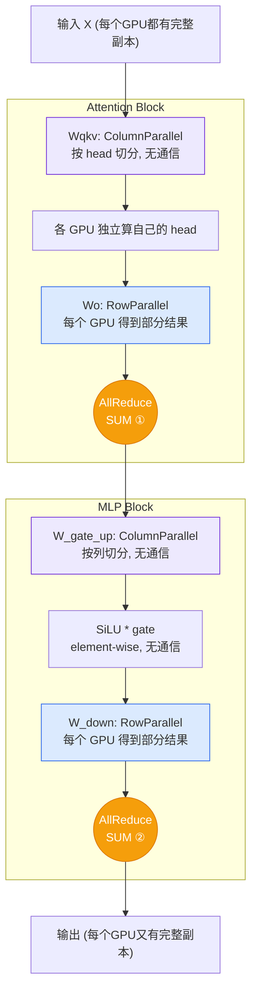
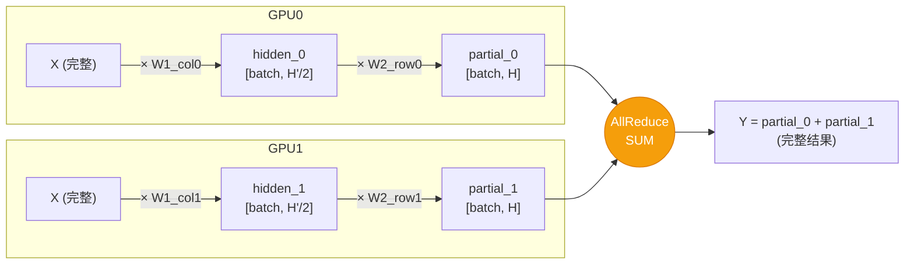
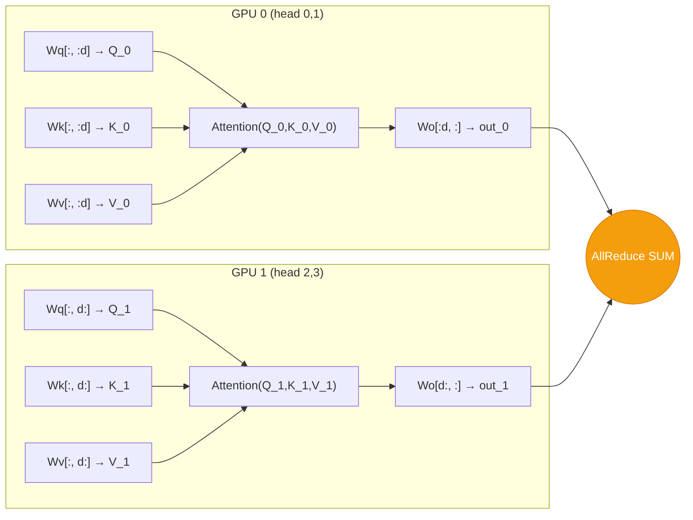

# Tensor Parallelism

## 核心思想

Tensor Parallelism (TP) 源自 **Megatron-LM**，将单个 Transformer 层内的矩阵按维度切分到多个 GPU 上。
通过巧妙选择列切 (Column Parallel) 和行切 (Row Parallel) 的组合，每层只需 **2 次 AllReduce**。

## 交互式图解

<TpVisualizer />

## 数据流

每个 Transformer 层的 TP 通信模式 (TP=2)：



## 两种 Parallel Linear

### ColumnParallelLinear (列并行)

权重 `W [H, H']` 按 **output 维度 (列)** 切分：

```
W = [W_1 | W_2 | ... | W_p]    每份: [H, H'/p]
```

```python
# 每个 GPU 拿到完整输入，乘以自己那一列
output_parallel = F.linear(input_, self.weight)  # [batch, H'/p]

if self.gather_output:
    output = all_gather(output_parallel)  # 一般不 gather
else:
    output = output_parallel  # 直接传给下游 RowParallel
```

**不做通信** — `gather_output=False` 时，每个 GPU 只持有部分列的输出。

### RowParallelLinear (行并行)

权重 `W [H', H]` 按 **input 维度 (行)** 切分：

```
    | W_1 |
W = | W_2 |    每份: [H'/p, H]
    | W_p |
```

```python
# 输入已经是 split 的 (来自上游 ColumnParallel)
input_parallel = input_  # [batch, H'/p]

# 部分输入 × 部分权重 → 部分结果
output_parallel = F.linear(input_parallel, self.weight)  # [batch, H]

# ★★★ AllReduce SUM — 这是 TP 唯一的通信点 ★★★
if self.reduce_results and tp_size > 1:
    output = all_reduce(output_parallel)
```

**做 AllReduce** — 因为 `Y = [X_1,...,X_p] @ [W_1;...;W_p] = Σ(X_i @ W_i)`

## Column + Row 配对原理



数学证明：

$$Y = X \cdot W_1 \cdot W_2 = X \cdot [W_{1,0} | W_{1,1}] \cdot \begin{bmatrix} W_{2,0} \\ W_{2,1} \end{bmatrix} = X W_{1,0} W_{2,0} + X W_{1,1} W_{2,1}$$

每个 GPU 独立算一项，最后 AllReduce SUM 即可。

## Attention 层的切分



- **Wq, Wk, Wv**: ColumnParallel — 每个 GPU 拿几个 head
- **Wo**: RowParallel — AllReduce 求和
- 多头注意力天然适合 TP：**不同 head 之间没有交互**

## MLP 层的切分

| 矩阵 | Parallel 类型 | 通信 |
|------|-------------|------|
| gate_proj (W_gate) | ColumnParallel | 无 |
| up_proj (W_up) | ColumnParallel | 无 |
| down_proj (W_down) | RowParallel | AllReduce |

gate_proj 和 up_proj 通常 fuse 成一个 ColumnParallel (`linear_fc1`)，
激活函数 SiLU 是 element-wise 的，可以在 split 状态下独立计算。

## 面试高频问答

::: details Q: TP 每层有几次通信？分别在哪里？
**2 次 AllReduce SUM**：
1. Attention 的 output projection (Wo) 之后
2. MLP 的 down_proj 之后

通信量：每次 AllReduce 传输约 `2 * batch * seq_len * hidden_size` 字节（ring AllReduce 下）
:::

::: details Q: 为什么 ColumnParallel 不需要通信？
因为 `gather_output=False`，每个 GPU 只保留自己那一列的输出。
下游的 RowParallel 会把这个 split 的输入当作自己的部分输入，
做完矩阵乘法后通过 AllReduce 合并。
:::

::: details Q: bias 怎么处理？
只在 rank 0 加 bias，其他 rank 的 bias 设为 None。
因为 AllReduce 是 SUM，如果每个 rank 都加 bias 就会加 p 次。
:::

::: details Q: TP 的局限性？
- 通信频繁（每层 2 次），要求 GPU 间有高带宽互连（NVLink/NVSwitch）
- 切分粒度受限于 head 数（num_heads 必须能被 tp_size 整除）
- TP 通常限制在单机内（8 卡），跨机走 PP 或 DP
:::

::: details Q: AllReduce 的实现？
Ring AllReduce：分 reduce-scatter + all-gather 两步，通信量 `2(N-1)/N * data_size`。
vLLM 中底层走 NCCL，或用 custom_all_reduce（利用 NVLink P2P 的优化实现）。
:::
