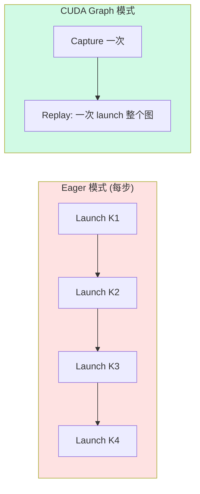

# CUDA Graph

**文件**: `vllm/v1/worker/gpu_model_runner.py`

---

## 问题：Decode 阶段的 Kernel Launch 开销

Decode 阶段每个 request 每步只生成 **1 个 token**，但 forward pass 包含的 kernel 数量和 prefill 一样多（Attention、MLP、LayerNorm、AllReduce...）。

```
Decode forward (batch=32):
  计算量: ~0.1ms per kernel
  kernel launch 开销: ~5-10μs per kernel × 数百个 kernel = 1-3ms
  
  → launch 开销占比可达 50%+
```

Decode 是典型的 **launch-bound** 场景。

---

## CUDA Graph 原理

CUDA Graph 将一系列 GPU 操作录制为一个图结构，之后 replay 时一次 launch 整个图：



```python
# 录制
graph = torch.cuda.CUDAGraph()
with torch.cuda.graph(graph, stream=stream):
    output = model(input_ids, positions, ...)

# 回放（输入通过 copy_ 更新）
input_ids_placeholder.copy_(real_input_ids)
graph.replay()  # 一次 launch，所有 kernel 按录制顺序执行
```

---

## vLLM 中的实现

### Capture 阶段（启动时）

```python
def capture_model(self):
    """启动时录制各 batch_size 的 CUDA Graph"""
    for batch_size in cudagraph_capture_sizes:  # [1, 2, 4, 8, ..., 192]
        graph_runner = CUDAGraphRunner(self.model)
        graph_runner.capture(
            input_ids=dummy_ids[:batch_size],
            positions=dummy_pos[:batch_size],
            attn_metadata=attn_metadata,
            memory_pool=self.graph_memory_pool,  # 共享显存池
        )
        self.graph_runners[batch_size] = graph_runner
```

关键细节：
- 从大到小录制（最大 batch 先分配显存池，小 batch 复用同一 pool）
- 每个 batch_size 录制一个独立的 graph
- `memory_pool` 共享：不同 graph 复用同一块显存，因为不会同时 replay

### Replay 阶段（推理时）

```python
# 在 execute_model 中
if decode_only:
    # 选最近的 capture size（向上取整）
    # batch=5 → pad 到 8
    graph_batch_size = _get_padded_batch_size(actual_batch_size)
    executor = self.graph_runners[graph_batch_size]

    # 更新占位 tensor 的值
    executor.input_ids[:actual_batch_size].copy_(real_input_ids)
    executor.positions[:actual_batch_size].copy_(real_positions)

    # 一次 replay
    executor.replay()
    output = executor.output[:actual_batch_size]  # 截取有效部分
else:
    # Prefill / mixed batch → Eager 模式
    output = self.model(input_ids, positions, ...)
```

---

## 为什么只对 Decode 使用

| | Decode | Prefill |
|---|---|---|
| 每个 request 的 token 数 | 固定 1 | 变长（prompt 长度各异） |
| Batch 内 shape | 可预知（num_reqs × 1） | 不可预知（总 token 数变化） |
| 计算量 | 小（launch-bound） | 大（compute-bound） |
| CUDA Graph 适用？ | ✅ 消除 launch 开销，收益大 | ❌ shape 不固定，无法录制 |

CUDA Graph **要求 tensor shape 完全固定**。录制时的 shape 和 replay 时必须一致。Decode 时每个 request 只有 1 个新 token，总 token 数 = batch_size，可以通过 padding 到预定义的 capture size 来适配。

---

## Padding 策略

实际 batch_size 可能不在预定义的 capture sizes 中：

```
Capture sizes: [1, 2, 4, 8, 16, 32, 64, 128, 192]

实际 batch=5  → pad 到 8,  浪费 3/8 = 37.5%
实际 batch=17 → pad 到 32, 浪费 15/32 = 46.9%
实际 batch=33 → pad 到 64, 浪费 31/64 = 48.4%
```

Padding 的 token 不参与实际计算（通过 mask 或截取输出），但 GPU 仍然为它们执行 kernel。**trade-off**：padding 浪费的计算 < eager 模式的 launch 开销。

当 batch_size 超过 `max_capture_size`（如 192）时，退回 eager 模式。此时 batch 足够大，compute-bound，launch 开销占比小。

---

## CUDA Graph 的限制

### 1. Shape 必须固定
录制时的所有 tensor shape 在 replay 时不能变。这就是为什么只能用于 decode（shape 可通过 padding 固定）。

### 2. 不能有控制流
Graph 内不能有 data-dependent 的 if/else。录制的是一条固定的执行路径。

### 3. 不能动态分配显存
Graph 内不能 `torch.empty()` 或 `torch.zeros()`。所有 tensor 必须在录制前分配好。

### 4. process_events() 被禁用
CUDA Graph replay 期间，PyTorch caching allocator 的 `process_events()` 不执行。这意味着：
- 跨 stream 使用的 tensor 需要手动 `record_stream()` 防止被提前回收
- 这正是实习项目中 [Multi-Stream NaN 问题](/internship/multi-stream-nan-fix) 的根因

### 5. 共享 Memory Pool
所有 graph 共享同一个 memory pool，意味着同一块显存可能被不同 graph 复用。这在同一时刻只有一个 graph 在 replay 时是安全的。

---

## 面试要点

::: details 常见面试问题

**Q: CUDA Graph 为什么能加速？**

消除 kernel launch 开销。Decode 阶段每步计算量小但 kernel 多，launch 开销占比高。CUDA Graph 把整个 forward pass 录制为一个图，replay 时一次 launch 所有 kernel，避免逐个 launch 的 CPU-GPU 交互。

**Q: 为什么只能用在 decode？**

CUDA Graph 要求 tensor shape 完全固定。Decode 时每个 request 只有 1 个新 token，total_tokens = batch_size，可以 pad 到预定义 size。Prefill 时 prompt 长度各异，shape 无法固定。

**Q: Padding 不浪费吗？**

浪费一些计算，但 decode 阶段本身是 launch-bound 不是 compute-bound。padding 多算的 FLOPs 远小于省下的 launch 开销。当 batch 很大时（>192）退回 eager 模式，因为此时 compute-bound，CUDA Graph 的收益小于 padding 的浪费。

**Q: CUDA Graph 有什么限制？**

Shape 固定、不能有 data-dependent 控制流、不能动态分配显存、caching allocator 的 process_events 被禁用（需要手动 record_stream 防止跨 stream 内存问题）。

:::
