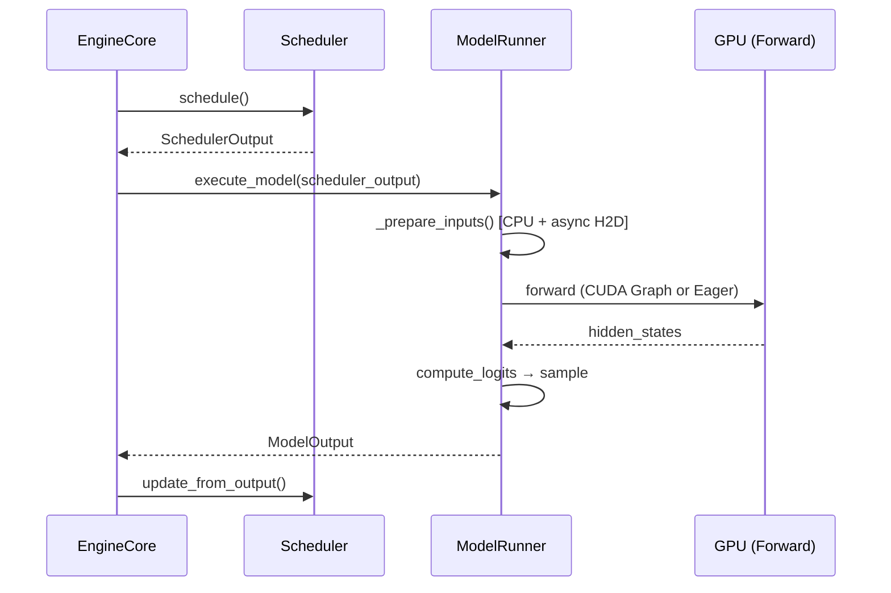
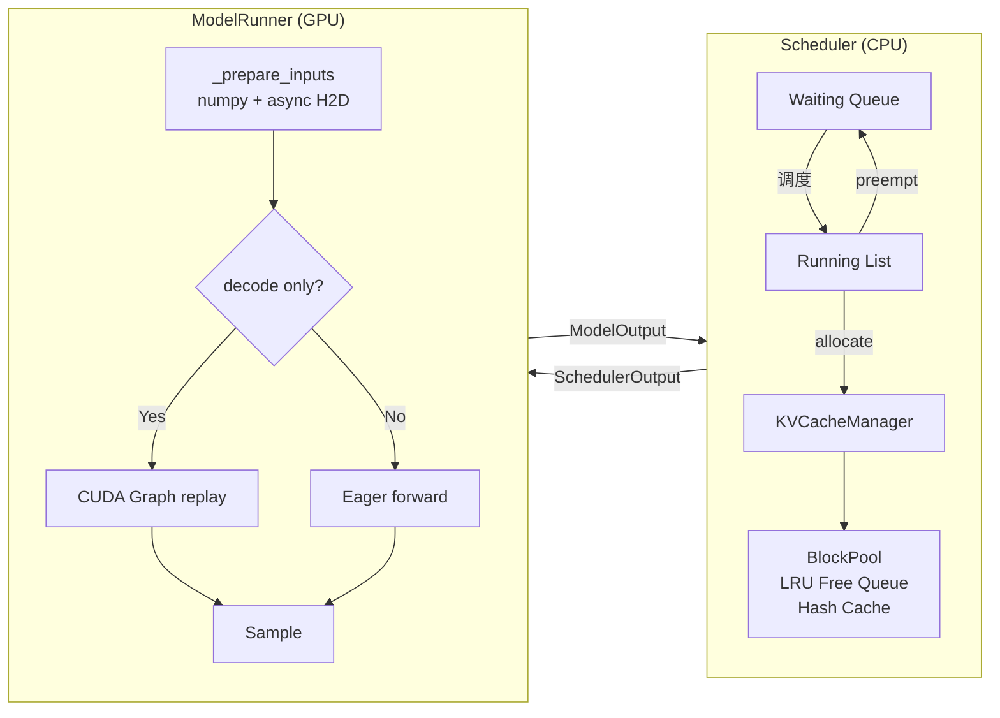

# vLLM 推理引擎框架

从全局到局部理解 vLLM（v1 架构）如何生成一个 token。

> 代码引用基于 [vLLM v0.8.x](https://github.com/vllm-project/vllm) 开源版本，文件路径均为 `vllm/v1/` 下。

---

## 全局循环：一个 Token 的生命周期



核心主循环只有 3 行（`vllm/v1/engine/core.py`）：

```python
def step(self) -> EngineCoreOutputs:
    scheduler_output = self.scheduler.schedule()
    output = self.model_executor.execute_model(scheduler_output)
    engine_core_outputs = self.scheduler.update_from_output(scheduler_output, output)
    return engine_core_outputs
```

每次 `step()` = **调度 → 执行 → 更新**，循环驱动所有 request 的 token 生成。

---

## 设计问题与解法总览

| 问题 | 解法 | 详细文档 |
|------|------|----------|
| GPU 利用率低（逐请求处理） | Continuous Batching | [Scheduler 调度](/knowledge/vllm/scheduling) |
| Prefill/Decode 互相阻塞 | Chunked Prefill | [Scheduler 调度](/knowledge/vllm/scheduling) |
| KV Cache 显存碎片 | PagedAttention + Block Pool | [KV Cache 管理](/knowledge/vllm/kv-cache) |
| 长文本 prompt prefix 重复计算 | Prefix Caching | [KV Cache 管理](/knowledge/vllm/kv-cache) |
| Decode 阶段 kernel launch 开销大 | CUDA Graph | [CUDA Graph](/knowledge/vllm/cuda-graph) |
| H2D 传输阻塞 GPU 计算 | Async Prepare Inputs | [Model Runner](/knowledge/vllm/model-runner) |
| Decode 太慢（自回归逐 token） | Speculative Decoding | [投机解码](/knowledge/vllm/speculative-decoding) |

---

## 核心数据流



---

## 各模块详解

- [**Scheduler 调度**](/knowledge/vllm/scheduling) — Continuous Batching、Chunked Prefill、Preemption
- [**KV Cache 管理**](/knowledge/vllm/kv-cache) — PagedAttention、Block Pool、Prefix Cache、显存计算
- [**CUDA Graph**](/knowledge/vllm/cuda-graph) — Capture/Replay、Decode 加速、限制与 padding
- [**Model Runner**](/knowledge/vllm/model-runner) — execute_model 流程、CPU/GPU overlap、async H2D
- [**投机解码**](/knowledge/vllm/speculative-decoding) — Draft-Verify、Acceptance Rate、常见策略
