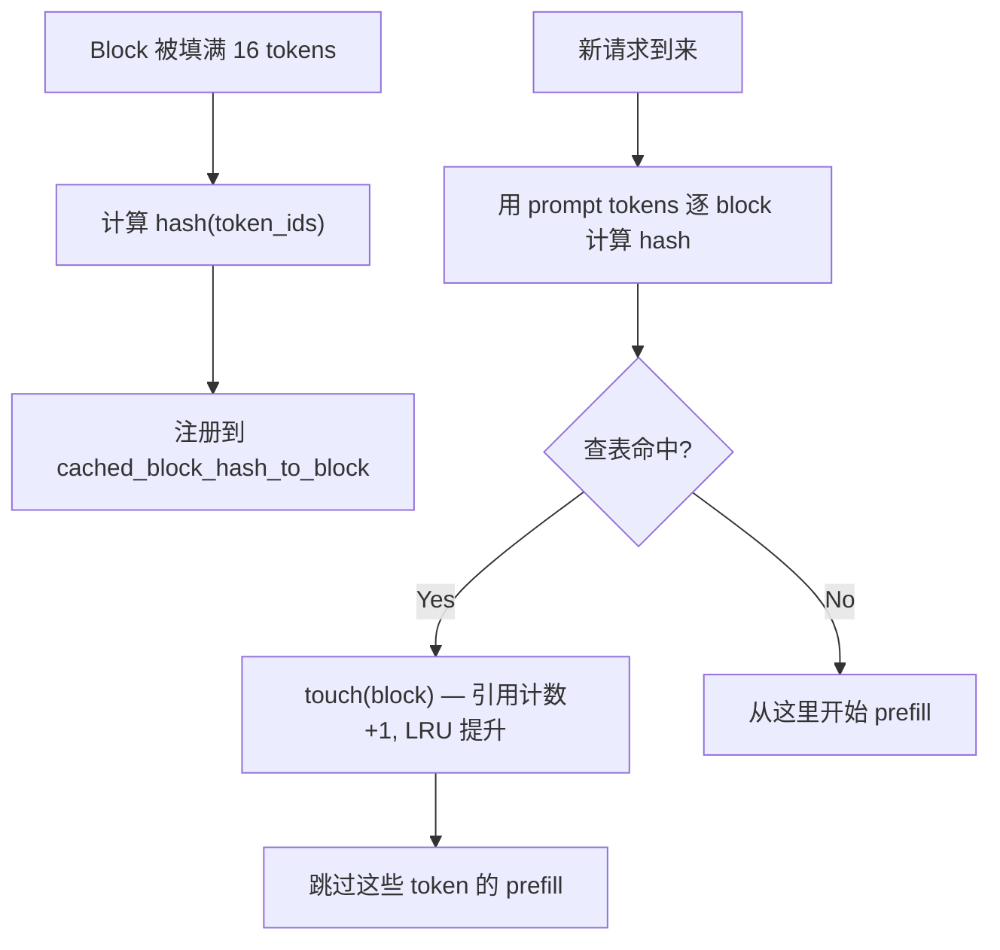

# KV Cache 管理

**文件**: `vllm/v1/core/kv_cache_manager.py`, `vllm/v1/core/block_pool.py`

---

## 为什么需要 KV Cache

Transformer 自回归生成时，每个新 token 的 Attention 需要之前所有 token 的 K、V：

$$\text{Attn}(q_t, K_{1:t}, V_{1:t}) = \text{softmax}\left(\frac{q_t K_{1:t}^T}{\sqrt{d}}\right) V_{1:t}$$

不缓存 → 每步重算所有历史 token 的 K/V，复杂度 $O(n^2)$。缓存后 → 每步只算新 token 的 $q_t, k_t, v_t$，追加到 cache 中。

---

## 显存占用计算

```
单请求 KV Cache = 2 × num_layers × num_kv_heads × head_dim × seq_len × dtype_bytes
```

以 LLaMA-70B（FP16）为例：

| 参数 | 值 |
|------|-----|
| num_layers | 80 |
| num_kv_heads | 8 (GQA) |
| head_dim | 128 |
| dtype_bytes | 2 (FP16) |
| seq_len | 4096 |

$$2 \times 80 \times 8 \times 128 \times 4096 \times 2 = 1.28 \text{ GB / request}$$

**batch=32 时需要 ~41 GB** 仅用于 KV Cache。这就是为什么 KV Cache 管理是推理系统的核心问题。

### MQA / GQA / MLA 对 KV Cache 的影响

| 方法 | KV Head 数 | KV Cache 大小 |
|------|-----------|-------------|
| MHA | = Q heads (如 64) | 最大（基准） |
| GQA | Q heads / G (如 8) | 基准的 1/G |
| MQA | 1 | 基准的 1/num_heads |
| MLA | 压缩维度 (如 512) | 很小 |

GQA 是目前最常用的方案（LLaMA-2/3、Mistral），在质量和 KV Cache 大小之间取得平衡。

---

## PagedAttention

### 传统方案的问题

传统方案按 `max_seq_len` 预分配连续显存：

```
Request A (实际 len=100, max=4096):
[████████████░░░░░░░░░░░░░░░░░░░░]  ← 97.6% 浪费
         ↑ 100 tokens    ↑ 4096 slots 预分配
```

- **内部碎片**：预分配远大于实际长度
- **外部碎片**：不同长度的请求释放后留下不连续空洞
- 系统能服务的并发请求数远低于显存理论上限

### PagedAttention：分页管理

借鉴 OS 虚拟内存的分页思想，将 KV Cache 切成固定大小的 **block**（如 16 tokens/block）：

```
物理 KV Cache 显存:
┌────────┬────────┬────────┬────────┬────────┬────────┐
│Block 0 │Block 1 │Block 2 │Block 3 │Block 4 │Block 5 │ ...
└────────┴────────┴────────┴────────┴────────┴────────┘

Request A 的 block_table: [0, 3, 5]      ← 逻辑连续，物理不连续
Request B 的 block_table: [1, 2, 4]

Attention 计算时:
  for block_idx in block_table[req]:
      K_block = kv_cache[block_idx]       ← 通过 block_table 寻址
      attn_score += Q @ K_block^T
```

效果：
- **按需分配**：生成到哪个 block 才分配哪个 block
- **零内部碎片**：最多浪费最后一个 block 的余量
- **零外部碎片**：任何空闲 block 都可以分给任何请求

---

## Block Pool 数据结构

```
┌─────────────────────────────────────────────┐
│               KVCacheManager                │
│  req_to_blocks: {req_id → [Block, ...]}     │
│  ├─ allocate_slots(req, num_tokens)         │
│  ├─ free(req)                               │
│  └─ get_computed_blocks(req)  [prefix cache]│
├─────────────────────────────────────────────┤
│                 BlockPool                    │
│  blocks: [KVCacheBlock × num_gpu_blocks]    │
│  free_block_queue: DoublyLinkedList (LRU)   │
│  cached_block_hash_to_block: {hash → block} │
│  ├─ get_new_blocks(n)                       │
│  ├─ free_blocks(blocks)                     │
│  └─ touch(blocks) [promote, prevent evict]  │
└─────────────────────────────────────────────┘
```

### allocate_slots：分配 KV Cache

```python
def allocate_slots(self, request, num_tokens, new_computed_blocks=None):
    req_blocks = self.req_to_blocks[request.request_id]

    # 计算需要多少 block
    num_computed_tokens = request.num_computed_tokens + len(new_computed_blocks) * block_size
    num_required_blocks = cdiv(num_computed_tokens + num_tokens, self.block_size)
    num_new_blocks = num_required_blocks - len(req_blocks) - len(new_computed_blocks)

    # 检查是否有足够的空闲 block
    if num_new_blocks > self.block_pool.get_num_free_blocks():
        return None  # 触发 scheduler preemption

    # Touch prefix cache blocks（提升 LRU 优先级，防止被驱逐）
    self.block_pool.touch(new_computed_blocks)
    req_blocks.extend(new_computed_blocks)

    # 从 free pool 分配新 block
    new_blocks = self.block_pool.get_new_blocks(num_new_blocks)
    req_blocks.extend(new_blocks)

    # 为满的 block 注册 hash（供后续 prefix cache 查找）
    self.block_pool.cache_full_blocks(request, req_blocks)
    return new_blocks
```

### BlockPool：LRU 驱逐

```python
class BlockPool:
    def __init__(self, num_gpu_blocks, enable_caching):
        self.blocks = [KVCacheBlock(idx) for idx in range(num_gpu_blocks)]
        self.free_block_queue = FreeKVCacheBlockQueue(self.blocks)  # 双向链表，LRU 顺序
        self.cached_block_hash_to_block = defaultdict(dict)         # hash → block

    def get_new_blocks(self, num_blocks):
        ret = []
        for _ in range(num_blocks):
            block = self.free_block_queue.popleft()       # 取最久未用的
            self._maybe_evict_cached_block(block)         # 清除旧 hash 元数据
            block.incr_ref()
            ret.append(block)
        return ret

    def free_blocks(self, ordered_blocks):
        for block in ordered_blocks:
            block.decr_ref()
            if block.ref_cnt == 0:
                self.free_block_queue.append(block)       # 放回队尾（最近使用）

    def touch(self, blocks):
        for block in blocks:
            if block.ref_cnt == 0:
                self.free_block_queue.remove(block)       # 从 free 队列移除
            block.incr_ref()                              # 引用计数 +1，防止驱逐
```

---

## Prefix Cache

相同 system prompt 或相似 prompt 前缀的请求，KV Cache 可以复用。

### 工作流程



### 示例

```
System prompt = "你是一个有帮助的 AI 助手。请用中文回答。" (48 tokens, 3 blocks)

Request 1: [system prompt] + "什么是 GPU?"
  → 3 blocks prefill + hash 注册 → 继续处理用户问题

Request 2: [system prompt] + "什么是 TP?"
  → prefix cache 命中 3 blocks → 直接复用 KV → 只 prefill 用户问题部分
```

### 驱逐策略

Prefix cache block 放在 free_block_queue 中但保留 hash 元数据。当显存紧张需要分配新 block 时：
1. 从 free_block_queue 头部取最久未用的 block
2. 如果该 block 有 cache hash，清除元数据（`_maybe_evict_cached_block`）
3. 高频使用的 prefix 通过 touch 不断提升优先级，不容易被驱逐

---

## Block 大小的 Trade-off

| | 小 Block（如 4） | 大 Block（如 64） |
|---|---|---|
| 内部碎片 | 小（最多浪费 3 tokens） | 大（最多浪费 63 tokens） |
| 管理开销 | 大（更多 block_table 条目） | 小 |
| Prefix Cache 粒度 | 细（更容易命中） | 粗（需要完整 64 tokens 才能匹配） |
| Attention kernel 效率 | 低（block 太小，GPU 利用率差） | 高（更大的连续访问） |

vLLM 默认 **block_size=16**，在粒度和效率之间取得平衡。

---

## 面试要点

::: details 常见面试问题

**Q: PagedAttention 解决什么问题？**

传统方式按 max_seq_len 预分配连续显存 → 巨大内部碎片 + 外部碎片。PagedAttention 将 KV Cache 切成固定大小的 block，按需分配，通过 block_table 映射逻辑连续到物理不连续的显存。类似 OS 虚拟内存分页。

**Q: KV Cache 显存占多少？**

`2 × layers × kv_heads × head_dim × seq_len × dtype_bytes`。LLaMA-70B FP16 下，单请求 4K tokens 就要 ~1.28 GB。这就是为什么 GQA（减少 kv_heads）和 PagedAttention（减少浪费）都很重要。

**Q: Prefix Cache 怎么保证正确性？**

按 token content 算 hash。只有 block 被填满（16 tokens）后才注册 hash。匹配时要求 block 内所有 token_id 完全相同。不同 sampling 参数不影响（K/V 只取决于输入 token）。

**Q: Block 大小怎么选？**

Trade-off：小 block 减少碎片、prefix cache 更细粒度，但管理开销大且 GPU kernel 效率低。大 block 反之。vLLM 默认 16，实测是比较好的平衡点。

:::
