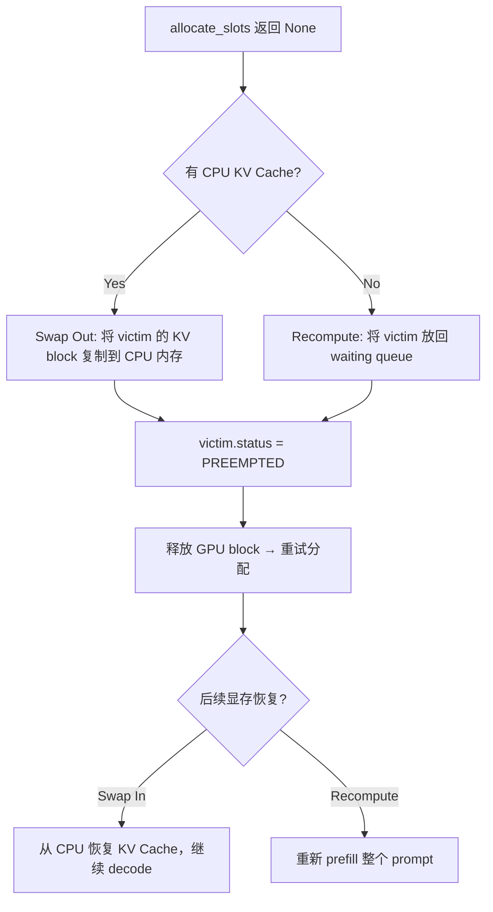

# Scheduler 调度

**文件**: `vllm/v1/core/sched/scheduler.py`

---

## Continuous Batching vs Static Batching

```mermaid
gantt
    title Static Batching
    dateFormat X
    axisFormat %s
    section Batch 1
    Req A (prefill+decode 20 tokens)  :0, 20
    Req B (prefill+decode 5 tokens)   :0, 5
    Req B 空等                        :5, 20
    section Batch 2
    Req C                             :20, 30
```



Static Batching 的问题：短请求生成完毕后必须等整个 batch 最慢的请求结束，GPU 严重浪费。

```mermaid
gantt
    title Continuous Batching
    dateFormat X
    axisFormat %s
    section GPU
    Req A (prefill)    :0, 3
    Req A+B (mixed)    :3, 5
    Req A+C (B完成,C插入) :5, 10
    Req A+C+D          :10, 15
```



**Continuous Batching**：每个 iteration 重新调度。某个请求生成 EOS 后立即移除，等待中的新请求立即插入——GPU 始终在满载工作。

---

## 设计思想：统一调度

vLLM v1 **没有独立的 prefill/decode 阶段**。每个 request 跟踪 `num_computed_tokens`，scheduler 统一按 token budget 调度：

```python
# 对于每个 request：
num_new_tokens = request.num_tokens - request.num_computed_tokens
```

- **Prefill 请求**：`num_computed_tokens < num_tokens` → `num_new_tokens > 1`（还有 prompt token 没算）
- **Decode 请求**：`num_computed_tokens == num_tokens - 1` → `num_new_tokens = 1`

Prefill 和 Decode 请求混在同一个 batch 里，不需要切换模式。

---

## 调度流程

```python
def schedule(self) -> SchedulerOutput:
    token_budget = self.max_num_scheduled_tokens

    # ═══ Phase 1: 调度已在运行的请求 ═══
    for request in self.running:
        num_new_tokens = min(
            request.num_tokens - request.num_computed_tokens,
            token_budget)
        new_blocks = self.kv_cache_manager.allocate_slots(request, num_new_tokens)
        if new_blocks is None:
            # OOM → Preempt：驱逐优先级最低的请求
            victim = self.running.pop()  # 末尾 = 最低优先级
            self.kv_cache_manager.free(victim)
            victim.status = PREEMPTED
        else:
            token_budget -= num_new_tokens

    # ═══ Phase 2: 调度等待队列中的新请求（仅在没有 preemption 时） ═══
    while self.waiting and token_budget > 0:
        request = self.waiting[0]
        # Prefix Cache 查找：已有哪些 block 可复用
        computed_blocks, num_computed_tokens = \
            self.kv_cache_manager.get_computed_blocks(request)
        num_new_tokens = min(request.num_tokens - num_computed_tokens, token_budget)
        new_blocks = self.kv_cache_manager.allocate_slots(
            request, num_new_tokens, computed_blocks)
        if new_blocks is None:
            break  # 容量不够，停止调度新请求
        self.waiting.popleft()
        self.running.append(request)
        token_budget -= num_new_tokens
```

### 两阶段策略

1. **Phase 1（Running）**：先保证已在运行的请求能继续推进。显存不够时从末尾驱逐（末尾 = 最低优先级 = 最新到达的请求）
2. **Phase 2（Waiting）**：如果没发生 preemption，才调度新请求。新请求先查 prefix cache，减少实际需要计算的 token 数

---

## Chunked Prefill

长 prompt（如 64K tokens）如果一次性 prefill，会独占 GPU 很久，阻塞所有 decode 请求。

**解法**：用 `max_num_scheduled_tokens`（token budget）限制每步最大 token 数。

```
Token Budget = 2048

Iteration 1: Req A prefill tokens[0:2048]
Iteration 2: Req A prefill tokens[2048:4096] + Req B decode (1 token) + Req C decode (1 token)
Iteration 3: Req A prefill tokens[4096:6144] + Req B decode + Req C decode
...
```

效果：
- 长 prefill 被切成多个 chunk，每个 chunk 和 decode 请求混排
- Decode 请求不再被长 prefill 阻塞，TTFT（首 token 延迟）更稳定
- 代价：长 prompt 的总 prefill 时间略增（多次调度开销）

实现上不需要特殊逻辑——`min(num_new_tokens, token_budget)` 天然限制每步处理的 token 数，下一步继续从 `num_computed_tokens` 处接着算。

---

## Preemption 与 Swap

当显存不够分配 KV Cache block 时：



**驱逐策略**：最低优先级（`self.running` 末尾），通常是最新到达的请求。

**Swap vs Recompute 的权衡**：
- Swap：需要额外 CPU 内存 + PCIe 带宽，但恢复快（直接拷贝回来）
- Recompute：不需要额外内存，但恢复慢（重新 prefill）

---

## 面试要点

::: details 常见面试问题

**Q: Continuous Batching 和 Static Batching 的区别？**

Static Batching 要等整个 batch 最慢的请求结束才能调度下一个 batch，短请求生成完后 GPU 空转。Continuous Batching 每个 iteration 重新调度，生成完的请求立即移除，新请求立即填入，GPU 利用率大幅提升。

**Q: Chunked Prefill 解决什么问题？**

长 prompt 一次性 prefill 会独占 GPU，阻塞正在 decode 的请求。Chunked Prefill 通过 token budget 限制每步最大 token 数，把长 prefill 切成多个 chunk 和 decode 请求混排，降低 TTFT 的方差。

**Q: 显存不够时怎么办？**

Scheduler 的 preemption 机制。`allocate_slots` 返回 None 时，驱逐优先级最低的 running request，释放其 KV block。被驱逐的请求可以 swap 到 CPU 内存（恢复时拷贝回来），或者放回 waiting queue 重新 prefill。

**Q: 为什么 Phase 2 只在没有 preemption 时才执行？**

如果已经发生了 preemption，说明显存紧张。此时再调度新请求只会导致更多 preemption，形成抖动。不如先让现有请求跑完释放显存。

:::
