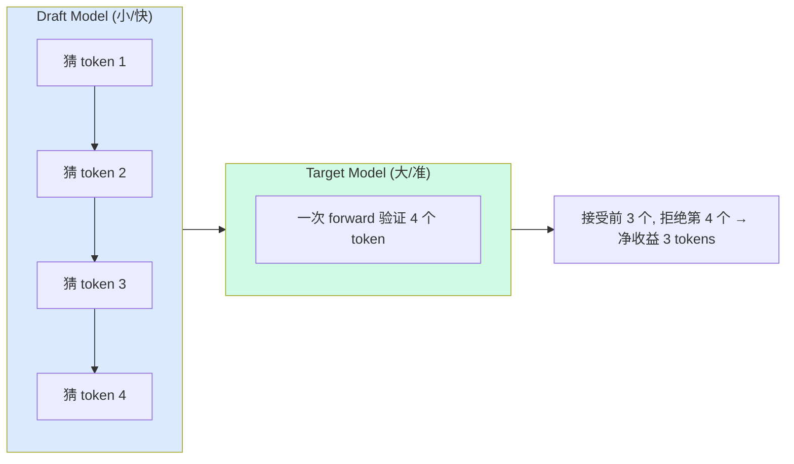

# 投机解码 (Speculative Decoding)

---

## 问题：Decode 太慢

自回归生成的根本瓶颈：**每步只生成 1 个 token**，但每步都要跑完整的 forward pass。

```
标准自回归 (生成 N tokens):
  Step 1: forward() → token_1      ~10ms
  Step 2: forward() → token_2      ~10ms
  ...
  Step N: forward() → token_N      ~10ms
  
  总时间 = N × 10ms
```

Decode 阶段是 **memory-bandwidth bound**（不是 compute bound）。batch=1 时 GPU 算力利用率极低——大部分时间在搬运模型权重，而不是在计算。

---

## 核心思想：Draft + Verify

用一个小模型（draft model）快速猜多个 token，然后用大模型（target model）一次 forward 验证所有猜测：



### 为什么这能加速？

Target model 验证 K 个 token 的时间 ≈ 生成 1 个 token 的时间（K 个 token 并行计算，都是 memory-bandwidth bound 不是 compute bound）。

```
标准: 生成 4 tokens = 4 × forward_target = 4T
投机: draft 4 tokens + verify 1 次 = 4×draft_time + 1×T ≈ 4×0.1T + T = 1.4T
    → 如果全部接受，加速 ~2.9×
```

---

## Draft-Verify 详细流程

```python
# 1. Draft phase: 小模型自回归生成 K 个候选 token
draft_tokens = []
draft_probs = []
for _ in range(K):
    logits = draft_model.forward(current_tokens)
    prob = softmax(logits)
    token = sample(prob)
    draft_tokens.append(token)
    draft_probs.append(prob[token])
    current_tokens.append(token)

# 2. Verify phase: 大模型一次 forward 处理所有候选
# 输入: original_context + draft_tokens (共 K+1 个位置)
target_logits = target_model.forward([...context, *draft_tokens])
target_probs = softmax(target_logits)

# 3. Accept/Reject: 从左到右逐个验证
accepted = []
for i in range(K):
    # 接受概率 = min(1, target_prob / draft_prob)
    accept_ratio = target_probs[i][draft_tokens[i]] / draft_probs[i]
    if random() < min(1, accept_ratio):
        accepted.append(draft_tokens[i])
    else:
        # 从修正分布中重采样，停止验证
        correction = max(0, target_probs[i] - draft_probs[i])
        resampled = sample(normalize(correction))
        accepted.append(resampled)
        break

# 4. 如果全部接受，额外从 target_probs[K] 采样一个 bonus token
if len(accepted) == K:
    bonus = sample(target_probs[K])
    accepted.append(bonus)
```

### 接受/拒绝的数学保证

接受概率 $\min\left(1, \frac{p_{\text{target}}(x)}{p_{\text{draft}}(x)}\right)$ 保证最终输出分布**完全等价于 target model 的分布**——不是近似，是数学严格等价。

- Draft 概率高、target 也高 → 大概率接受
- Draft 概率高但 target 低 → 大概率拒绝（draft 猜错了）
- 拒绝时从修正分布采样，保证不引入 bias

---

## Acceptance Rate 与加速比

假设 draft 长度 K，平均每个 token 的接受率为 $\alpha$：

$$\text{平均接受 tokens} = \frac{1 - \alpha^{K+1}}{1 - \alpha}$$

$$\text{加速比} \approx \frac{\text{平均接受 tokens}}{1 + K \times c}$$

其中 $c = \frac{t_{\text{draft}}}{t_{\text{target}}}$ 是 draft/target 的时间比。

| 接受率 α | K=4, 平均接受 | 加速比 (c=0.1) |
|---------|-------------|---------------|
| 0.9 | 4.1 | 2.9× |
| 0.7 | 2.7 | 1.9× |
| 0.5 | 1.9 | 1.4× |
| 0.3 | 1.4 | 1.0× (无收益) |

**关键洞察**：
- 接受率 < 0.5 时基本没有加速收益
- Draft model 越接近 target model → 接受率越高 → 加速越大
- K 不是越大越好：K 太大时后面的 token 接受率下降，且 draft 开销增加

---

## 常见 Draft 策略

### 1. 独立小模型

用同系列的小模型做 draft（如 LLaMA-7B draft + LLaMA-70B target）。

- 优点：实现简单，draft 模型可独立部署
- 缺点：需要额外显存放 draft 模型，两个模型的 vocab 必须一致

### 2. Medusa Head

在 target model 的最后一层后加多个 MLP head，每个 head 预测不同位置的 token：

```
Target model hidden_state → Head 0: 预测 pos+1
                          → Head 1: 预测 pos+2
                          → Head 2: 预测 pos+3
```

- 优点：不需要额外模型，复用 target 的 hidden state
- 缺点：需要训练 Medusa head，不同位置的准确率下降快

### 3. Eagle

类似 Medusa 但更进一步：用一个轻量级的自回归 draft head，输入是 target model 的 hidden state + 已生成 token 的 embedding。

- 优点：比 Medusa 准确率高（有自回归依赖）
- 缺点：实现更复杂

### 4. MTP — Multi-Token Prediction（非 vLLM 原生）

::: warning 非 vLLM 原生
MTP 是 DeepSeek-V3 / R1 的投机解码方案，在 ares 框架中实现（longcat_mtp）。vLLM 开源版有 Eagle 但不含 MTP。
:::

DeepSeek-V3 在训练时就有 MTP 结构（`num_nextn_predict_layers`），推理时直接复用这些层作为 draft head，不需要额外训练。

**MTP Layer 结构**：

```python
class MtFlashMoeMultiTokenPredictorLayer(nn.Module):
    def __init__(self, config):
        self.enorm = RMSNorm(config.hidden_size)     # embedding 归一化
        self.hnorm = RMSNorm(config.hidden_size)     # hidden state 归一化
        self.eh_proj = Linear(hidden_size * 2, hidden_size)  # 拼接投影
        self.transformer_layer = ParallelTransformerLayer(config)  # 一层完整 Transformer
        self.final_layernorm = RMSNorm(config.hidden_size)

    def forward(self, decoder_input, positions, previous_hidden_states):
        decoder_input = self.enorm(decoder_input)
        previous_hidden_states = self.hnorm(previous_hidden_states)
        # 拼接 token embedding + target 模型的 hidden state → 投影
        hidden_states = self.eh_proj(
            torch.cat([decoder_input, previous_hidden_states], dim=-1))
        # 过一层 Transformer（含 Attention + MLP）
        hidden_states = self.transformer_layer(hidden_states, positions)
        return self.final_layernorm(hidden_states)
```

**自回归 Draft 循环**（在 `EagleProposer.propose` 中）：

```python
all_draft_token_ids = []
for step in range(num_speculative_tokens):
    # MTP forward: 输入 = 上一步 token embedding + target hidden state
    hidden_states = mtp_model(input_ids, positions, previous_hidden_states)

    # 贪心采样 draft token
    logits = mtp_model.compute_logits(hidden_states[last_token_indices])
    tokens = logits.argmax(dim=-1)
    all_draft_token_ids.append(tokens)

    # 下一步：position +1, slot_mapping +1, 用新 token 的 embedding
    positions[last_token_indices] += 1
    input_ids[last_token_indices] = tokens
    previous_hidden_states[:] = hidden_states  # 传递 hidden state
```

**MTP vs Eagle 的区别**：
- Eagle：需要**额外训练**一个 draft head，和 target model 是分开的
- MTP：DeepSeek-V3 训练时就包含 MTP 层，推理时直接复用，**零额外训练成本**
- 两者的推理流程几乎一样：自回归生成 K 个 draft token → target verify

### 5. Self-Speculative

利用 target model 自身做推测：跳过部分层做 draft，完整层做 verify。

- 优点：零额外显存
- 缺点：加速比有限（draft 和 target 共享大部分计算）

---

## 面试要点

::: details 常见面试问题

**Q: Speculative Decoding 为什么能加速？**

利用 LLM decode 阶段是 memory-bandwidth bound 这个特性。验证 K 个 token 的计算量远小于 K 倍（并行计算，瓶颈在搬权重不在算力）。只要 draft model 足够快且接受率足够高，净收益就是正的。

**Q: 输出质量会下降吗？**

不会。接受/拒绝机制基于 $\min(1, p_{\text{target}}/p_{\text{draft}})$，数学上保证最终分布和直接用 target model 采样**完全一致**。被拒绝时从修正分布重采样，不引入任何 bias。

**Q: Acceptance Rate 受什么影响？**

1. Draft model 和 target model 的分布差距（越接近越高）
2. 当前 context 的"确定性"（确定性高的 token 如 "the"、"of" 容易被猜中）
3. Draft 长度 K（K 越大，后面的 token 越难猜）
4. Temperature（低 temperature → 分布集中 → 接受率高）

**Q: Draft model 怎么选？**

权衡 draft 速度和接受率。理想的 draft model：运行时间 < target 的 10%，接受率 > 70%。常见选择：同系列小模型（LLaMA-7B draft LLaMA-70B）、Medusa/Eagle head（零额外模型开销）、Self-Speculative（零额外显存）。

:::
